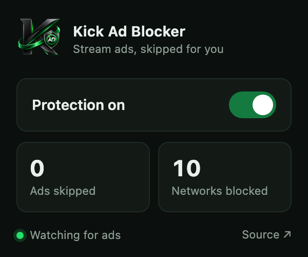

<div align="center">


# Kick Ad Blocker

**Kick shows you an ad before it shows you the stream. This extension deletes that moment.**

[](LICENSE)
[](https://developer.chrome.com/docs/extensions/develop/migrate)
[](#no-build-step)
[](https://github.com/oguzhan18/kick-ad-blocker/stargazers)

</div>

---

<div align="center">
  
</div>

Install it, open a channel, done. No per-stream setup, no filter lists to
subscribe to, no options page to read. One toggle and two counters.

## Two layers, and that's the whole design

**Network layer.** A static `declarativeNetRequest` rule set drops requests to
the usual ad and measurement hosts — DoubleClick, googlesyndication, adnxs,
amazon-adsystem, the IMA SDK — before the page ever sees them. Declarative
rules run inside Chrome's network stack: no background loop, no JavaScript per
request, no measurable cost.

**Player layer.** Kick's player labels its own ads — a click-catcher overlay, a
"Learn More" button, an `Ad progress` bar, an `Ad 1 of 2` badge. A content
script watches for those markers, and the moment one appears it blanks the
frame, mutes the audio, hides every piece of ad chrome, and runs the clip at
16x while seeking to the edge of the buffer.

When the markers disappear, everything goes back exactly as it was — including
the mute state and playback rate the viewer had chosen before the ad.

## Install

```
1. Open chrome://extensions
2. Turn on Developer mode
3. Load unpacked → select this folder
```

## The permission list is two lines, and that's the point

| Permission              | Why it exists                              |
| ----------------------- | ------------------------------------------ |
| `declarativeNetRequest` | the block list in `rules/ad-networks.json` |
| `storage`               | the on/off toggle and the ads counter      |

No `host_permissions`, so Chrome never shows *"read your data on all
websites."* A declared content script is granted by its `matches` alone, and a
`block` rule needs no host permission — only `redirect` and `modifyHeaders` do.
The player script runs on `kick.com` and nowhere else; the network block list
still applies everywhere.

Nothing is collected, nothing is sent anywhere. The two counters live in
`chrome.storage.local` on your machine.

## The two details that make the skip actually work

Most naive implementations of this stall the player instead of skipping the ad.
Two rules avoid that:

**Never seek to `duration`.** On an MSE/HLS player that timestamp is not
buffered, so playback hangs there and `ended` never fires — the ad freezes
on screen and its overlay never tears down. The seek target is pinned half a
second *inside* loaded media (`SEEK_SAFETY_MARGIN_S`), and the seek is skipped
entirely when there is under a second to gain, because landing on the buffer
edge re-stalls the player for nothing.

**Throttle the pokes.** The `MutationObserver` fires many times per second
while the controls animate, and seeking on every one of them pins playback in
place. Writes to the video are rate-limited to `PLAYER_NUDGE_INTERVAL_MS`. The
observer watches `data-testid` and `aria-label` only — never `class`, which the
player rewrites constantly — with a 500 ms interval as a safety net, because
players recreate the `<video>` node mid-ad.

If an ad marker somehow never clears, a three-minute failsafe hands the player
back rather than leaving it blacked out.

## What it can't do

Worth saying out loud, because every ad blocker has this section and most
skip it:

- **Fast-forward only works on *discrete* ad clips** — a separate, seekable
  `<video>` with a finite `duration`. Under **server-side ad insertion
  (SSAI)** the ad is stitched into the same HLS manifest as the stream: there
  is no separate clip to seek and no ad request to block. Beating that means
  manifest/segment surgery — a filtering proxy or a custom MSE loader — which
  is a different project than a content script.
- **Hiding and muting always work.** Whatever the delivery, the overlay comes
  off and the audio goes quiet.
- **The skip is bounded by download speed, not playback speed.** At 16x pinned
  to the buffer edge, the ad is consumed as fast as its segments arrive, so the
  player's spinner runs for the whole ad. That spinner is hidden rather than
  avoided — keeping it quiet would mean playing the ad closer to real time,
  which is the opposite of the goal.
- Selectors are tuned to Kick's current markup. If the site ships a redesign,
  `AD_SIGNAL_SELECTORS` and `AD_DECORATION_SELECTORS` are the one place to fix.

## No build step

```
manifest.json
icons/                        16 / 32 / 48 / 128 px
rules/ad-networks.json        declarativeNetRequest block list
src/
  shared/constants.js         storage keys, message types, repo URL
  content/ad-blocker.js       detector · mask · player · controller
  background/service-worker.js
  popup/index.html · popup.css · popup.js
```

No bundler, no transpiler, no `node_modules`. `shared/constants.js` is a plain
script loaded three ways — listed in `content_scripts`, `importScripts()`d by
the service worker, and a `<script>` tag in the popup — so all three contexts
agree on the storage keys without a module graph. Edit a file, hit reload.

`content/ad-blocker.js` splits into four units with one job each:

| Unit         | Owns                                                     |
| ------------ | -------------------------------------------------------- |
| `detector`   | is an ad on screen right now                              |
| `mask`       | the CSS that blanks the frame and the ad chrome           |
| `player`     | mute, seek and rate-control every `<video>`, then undo it |
| `controller` | the state machine — the only unit that decides *when*     |

The source carries no comments by design. The reasoning lives here; named
constants (`SEEK_SAFETY_MARGIN_S`, `PLAYER_NUDGE_INTERVAL_MS`,
`STUCK_AD_TIMEOUT_MS`) stand in for the explanations that would otherwise sit
inline.

## Contributing

Blocking one more ad network is six lines of JSON in `rules/ad-networks.json` —
next free `id`, one rule per host:

```json
{
  "id": 11,
  "priority": 1,
  "action": { "type": "block" },
  "condition": {
    "urlFilter": "||example-ads.com^",
    "resourceTypes": ["script", "xmlhttprequest", "image", "sub_frame", "media"]
  }
}
```

Broken detection after a Kick redesign? Open an issue with the player's DOM
around the ad overlay — that snippet is the whole fix.

## License

[MIT](LICENSE) — do what you like.

Not affiliated with, endorsed by, or connected to Kick.com or Kick Streaming
Pty Ltd. The logo is original artwork; "Kick" is used only to name the site
this extension works on.
